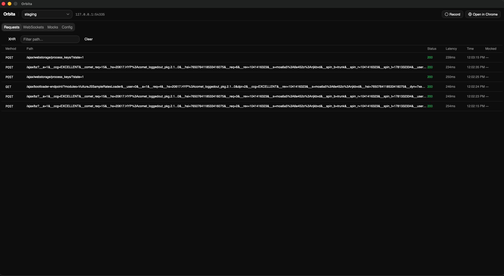
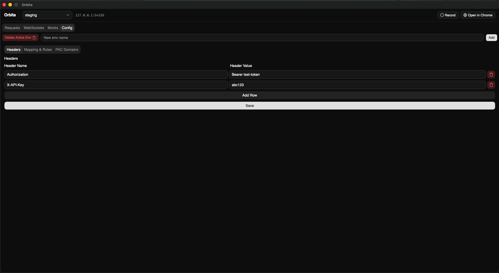

# Orbita

A native desktop proxy utility for developers and QA engineers. Intercept, inspect, mock, and record HTTP/WebSocket traffic with zero config.

Built with [Go](https://go.dev), [Wails v2](https://wails.io), and React.

---

## Features

**Traffic Inspection**
- Intercept HTTP and HTTPS requests with live request log
- Filter by XHR/API traffic, search by path
- Timestamps and latency per request

**Mocking**
- Right-click any request to create a mock
- Set custom response body and status code
- Toggle mocks on/off without deleting them

**Environment Management**
- Create multiple environments with custom headers injected into every proxied request
- Define URL rewrite rules per environment
- Import JSON env config and swap between environments instantly

**Playwright Test Recording**
- Attach to an existing Chrome tab via CDP
- Records navigation, clicks, form inputs, and network calls
- Generates a ready-to-run Playwright test script — copy and go

**WebSocket Inspection**
- Intercept and log WebSocket frames in real time
- Direction (send/receive), timestamp, URL, and payload per frame

**PAC File Routing**
- Auto-generates a PAC (Proxy Auto-Config) file
- Domains auto-extracted from imported env config
- Add/remove domains manually
- Chrome launched with PAC URL — only matching domains route through the proxy

---

## Screenshots




---

## Requirements

- macOS (arm64 or amd64)
- [Go 1.21+](https://go.dev/dl/)
- [Node.js 18+](https://nodejs.org)
- [Wails v2](https://wails.io/docs/gettingstarted/installation)

Install Wails:

```bash
go install github.com/wailsapp/wails/v2/cmd/wails@latest
```

---

## Build

**Development (hot reload):**

```bash
wails dev
```

**Production build:**

```bash
wails build
```

Output: `build/bin/orbita.app`

**Universal binary (Intel + Apple Silicon):**

```bash
wails build -platform darwin/universal
```

---

## Run

Open the built app:

```bash
open build/bin/orbita.app
```

On first launch macOS may block the app — right-click → Open to bypass Gatekeeper.

---

## Usage

1. Launch Orbita — proxy starts automatically on a local port
2. Click **Open in Chrome** — launches Chrome pre-configured with the proxy and PAC routing
3. Browse — requests appear live in the **Requests** tab
4. Right-click a request → **Mock this endpoint** to create a mock response
5. Go to **Config** to manage environments, headers, rewrite rules, and PAC domains
6. Click **Record** to start a CDP session, interact with the page, click **Stop** to generate a Playwright test

---

## Author

Angshuman Halder
