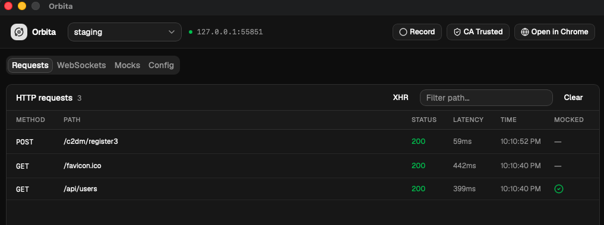
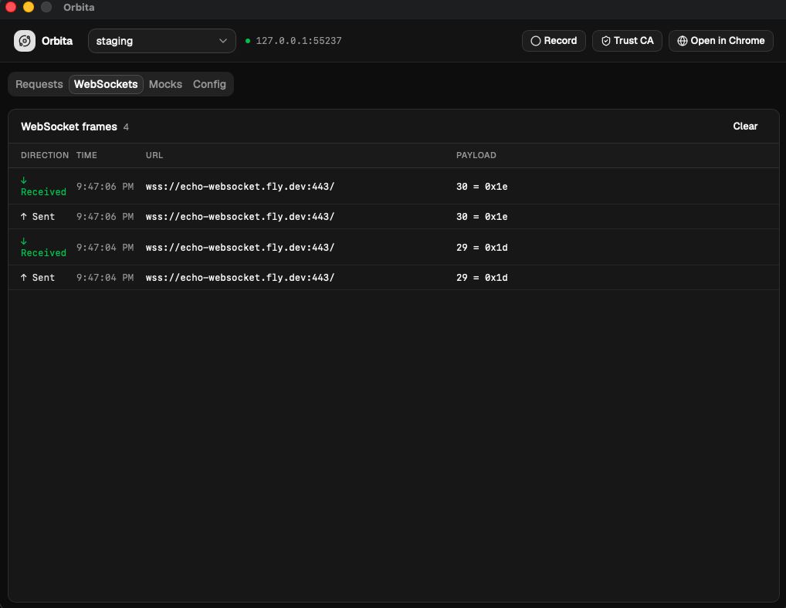
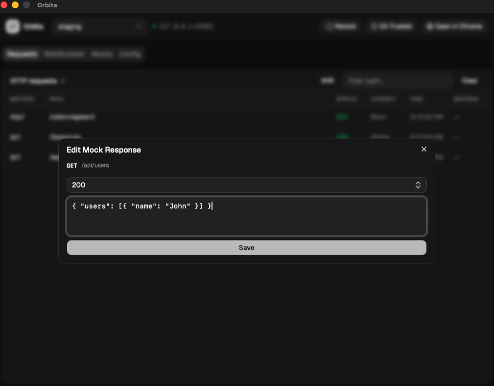

# Orbita

A native desktop proxy utility for developers and QA engineers. Intercept, inspect, mock, and record HTTP/WebSocket traffic with minimal setup.

Built with [Go](https://go.dev), [Wails v2](https://wails.io), and React.

> **Status:** Active development. Orbita is currently distributed as a
> source build for macOS and is intended for local development and QA
> workflows.

---

## Features

**Traffic Inspection**
- Intercept HTTP and HTTPS requests with live request log
- Filter by XHR/API traffic, search by path
- Timestamps and latency per request

**Mocking**
- Right-click any request to create a mock
- Set custom response body and status code
- Toggle mocks on/off without deleting them

**Environment Management**
- Create multiple environments with custom headers injected into every proxied request
- Define URL rewrite rules per environment
- Import JSON env config and swap between environments instantly

**Playwright Test Recording**
- Attach to an existing Chrome tab via CDP
- Records navigation, clicks, form inputs, and network calls
- Generates a ready-to-run Playwright test script — copy and go

**WebSocket Inspection**
- Intercept and log WebSocket frames in real time
- Direction (send/receive), timestamp, URL, and payload per frame

**PAC File Routing**
- Auto-generates a PAC (Proxy Auto-Config) file
- Domains auto-extracted from imported env config
- Add/remove domains manually
- Chrome launched with PAC URL — only matching domains route through the proxy

---

## Screenshots





---

## Architecture

- **Wails desktop host:** exposes native application operations to the React UI.
- **Go proxy:** listens only on a loopback address, intercepts HTTP, HTTPS, and
  WebSocket traffic, and applies mocks, headers, and rewrite rules.
- **React interface:** receives live network events through the Wails runtime
  and manages environments, mocks, PAC domains, and recorded test output.
- **CDP recorder:** attaches to Chrome, captures browser interactions and
  matching network activity, and generates Playwright test code.

---

## Requirements

- macOS (arm64 or amd64)
- [Go 1.26+](https://go.dev/dl/)
- [Node.js 22.12](https://nodejs.org) (pinned in `.nvmrc`)
- [Wails v2](https://wails.io/docs/gettingstarted/installation)

Install Wails:

```bash
go install github.com/wailsapp/wails/v2/cmd/wails@latest
```

---

## Build

**Development (hot reload):**

```bash
wails dev
```

**Production build:**

```bash
wails build
```

Output: `build/bin/orbita.app`

**Universal binary (Intel + Apple Silicon):**

```bash
wails build -platform darwin/universal
```

---

## Run

Open the built app:

```bash
open build/bin/orbita.app
```

On first launch macOS may block the app — right-click → Open to bypass Gatekeeper.

---

## Verify

Run the Go test suite:

```bash
go test ./...
```

Install and build the frontend:

```bash
cd frontend
npm ci
npm run build
```

---

## Security note

Orbita generates a local certificate authority under `~/.config/orbita/` so it
can inspect HTTPS traffic. The private key is stored with `0600` permissions.
Orbita never trusts the certificate automatically; click **Trust CA** when you
need HTTPS inspection, then approve the macOS administrator prompt. Use Orbita
only with development or test traffic you are authorized to inspect.

To remove the trusted CA, open **Keychain Access**, search the System keychain
for **Orbita CA**, and delete it. You may also remove Orbita's local files:

```bash
rm -rf ~/.config/orbita
```

---

## Usage

1. Launch Orbita — proxy starts automatically on a local port
2. Click **Trust CA** once if you need HTTPS inspection
3. Click **Open in Chrome** — launches Chrome pre-configured with the proxy and PAC routing
4. Browse — requests appear live in the **Requests** tab
5. Right-click a request → **Mock this endpoint** to create a mock response
6. Go to **Config** to manage environments, headers, rewrite rules, and PAC domains
7. Click **Record** to start a CDP session, interact with the page, click **Stop** to generate a Playwright test

---

## Author

Angshuman Halder

## License

[MIT](LICENSE)
